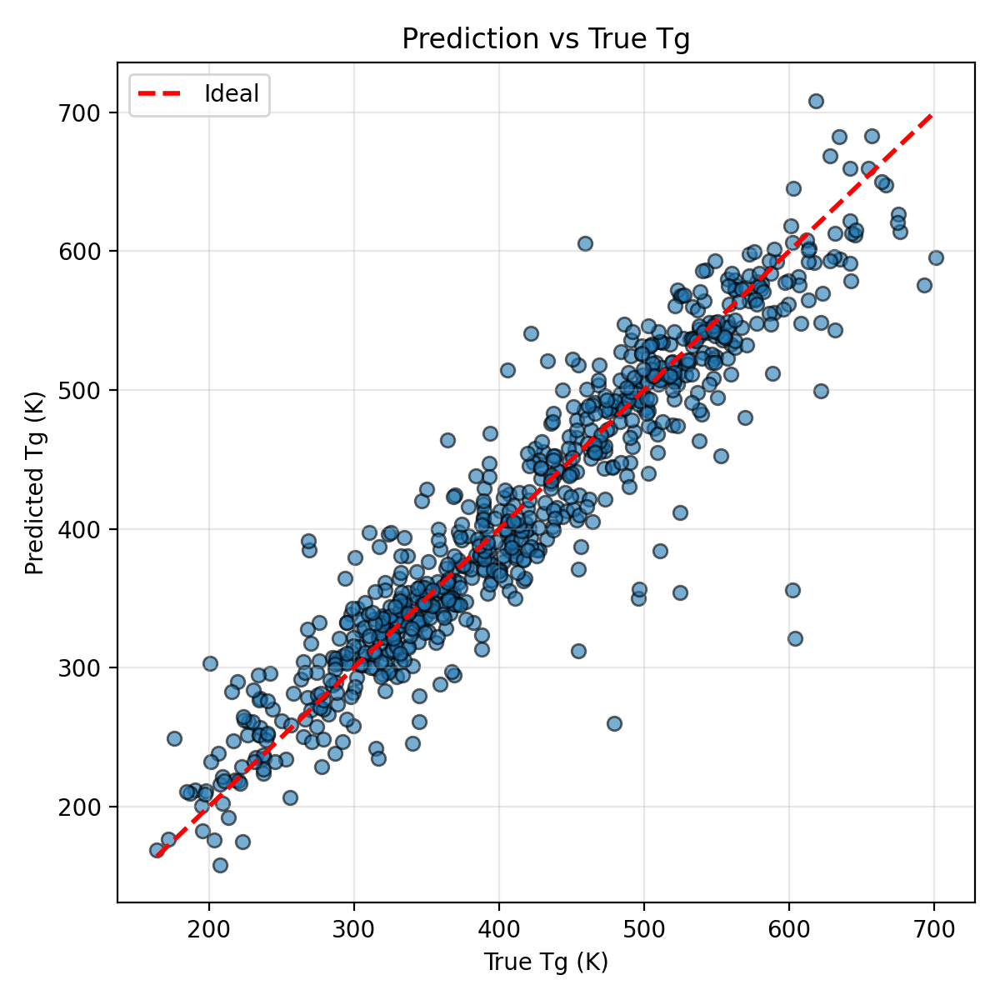

# PolymersPropertyPrediction: Polymer Tg Property Prediction with GCN+GAT

**GCN+GAT** 


## Features

* Graph-Based Molecular Representation – Converts polymer SMILES strings into atom–bond graphs, enabling graph neural network learning of structural relationships.
* Custom GNN Architectures – Includes flexible models such as GCN, GIN, or custom gated graph convolution layers tailored for polymer property prediction.
* Efficient Data Handling – Built-in dataset preprocessing and NPZ graph loading for fast and reproducible experiments.

## Environment Setup

```bash
conda create -n Env4GNN python=3.8
conda activate Env4GNN
pip install -r requirements.txt
```

## Dataset Preparation

1. **Dataset Source**  
   The project uses a curated polymer dataset such as `LAMALAB_CURATED_Tg_structured.csv`, which contains polymer structures represented by PSMILES strings and their corresponding experimental glass transition temperatures (Tg).
   The dataset.csv comes from 1. Kunchapu S, Jablonka KM. PolyMetriX: An Ecosystem for Digital Polymer Chemistry. ChemRxiv. 2025; doi:10.26434/chemrxiv-2025-s2f2r  This content is a preprint and has not been peer-reviewed.

2. **Input Format**  
   Each row of the dataset should include at least the following columns:
```bash
PSMILES, Tg
CCOCC, 150.2
CCCCCO, 130.7
...
```
3. **Graph Conversion**  
The script [`PSMILES_to_graph.py`](./PSMILES_to_graph.py) converts each polymer’s PSMILES string into a molecular graph.  
- **Nodes** represent atoms with their chemical features (atomic number, valence, hybridization, etc.).  
- **Edges** represent bonds and their attributes (bond type, aromaticity, conjugation).  
- The resulting graphs are saved in `.npz` format for fast loading.

4. **Dataset loading**
The class NPZGraphDataset handles graph data loading and batching for PyTorch Geometric.
It automatically:
- Normalizes Tg values (if specified),
- Splits data into training, validation, and test subsets,
- Prepares DataLoader objects for efficient GPU training.

5. **Directory Structure**
```bash
graph_npz/
├── batch_0/   
├── batch_1/                  
├── batch_2/                               
├── ...                            
└── manifest.csv                            
```

## Training (Terminal)

Example command:

```bash
python TrainModel.py - Command-line training script converted from the user's notebook.
Usage example:
python TrainModel.py \
  --data_path ./graph_npz/manifest.csv \
  --root_dir ./ \
  --epochs 50 \
  --batch_size 32 \
  --lr 1e-3 \
  --weight_decay 1e-4 \
  --optimizer adamw \
  --loss mse \
  --scheduler cosine \
  --seed 42 \
  --device auto \
  --log_dir ./logs \
  --checkpoint_dir ./checkpoints
```

* `model.pt` (model weights and metadata)
* `log` (training log)

Notes:

* Automatically detects GPU/CPU; 

## Inference (Terminal)

Batch prediction from CSV:

```bash
Usage example:
python predict.py \
  --ckpt_path ./weights/BestModel.pt \
  --manifest ./graph_npz/manifest.csv \
  --root_dir ./ \
  --batch_size 64 \
  --device auto \
  --out_png output.png \
  --out_csv preds.csv \
  --test_size 0.2 \
  --seed 42 \
  --layers_in_conv 3 \
  --channels 64 \
  --num_node_types 9
```

* `--ckpt_path` can be a directory or a direct path to `model.pt`

## Model Performance
| Model             | Set  |   MSE    |  RMSE  |  MAE  |   R²    |
|--------------------|------|----------|--------|-------|---------|
| Linear Regression  | Test | 2328.74  | 48.26  | 34.89 | 0.8091  |
| Ridge Regression   | Test | 2480.93  | 49.81  | 36.70 | 0.7966  |
| ElasticNet         | Test | 10908.86 | 104.45 | 87.94 | 0.1058  |
| Random Forest      | Test | 2323.49  | 48.20  | 34.40 | 0.8095  |
| Gradient Boosting  | Test | 2617.66  | 51.16  | 38.28 | 0.7854  |
| SVR                | Test | 4418.71  | 66.47  | 51.92 | 0.6378  |
| Neural Network     | Test | 1896.81  | 43.55  | 29.35 | 0.8445  |
| XGBoost            | Test | 2105.86  | 45.89  | 32.53 | 0.8274  |
| GCNModel           | Test | —        | 38.31  | 25.88 | 0.8840  |

* The machine learning models use the embedding made by PolyBERT as input, and the Tg as labels to do the prediction. 
* All the models(including the GCNModel) perform at the same dataset and spliting



## License